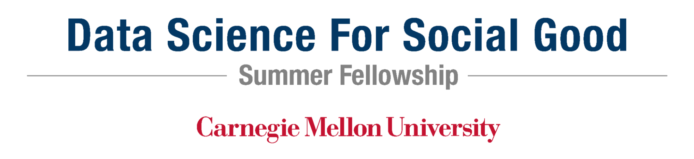
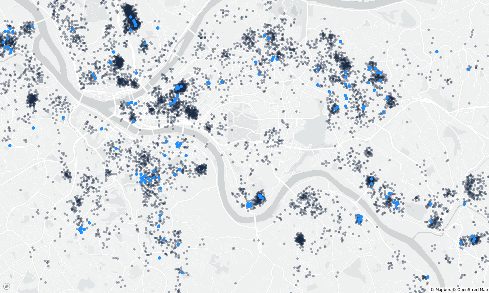
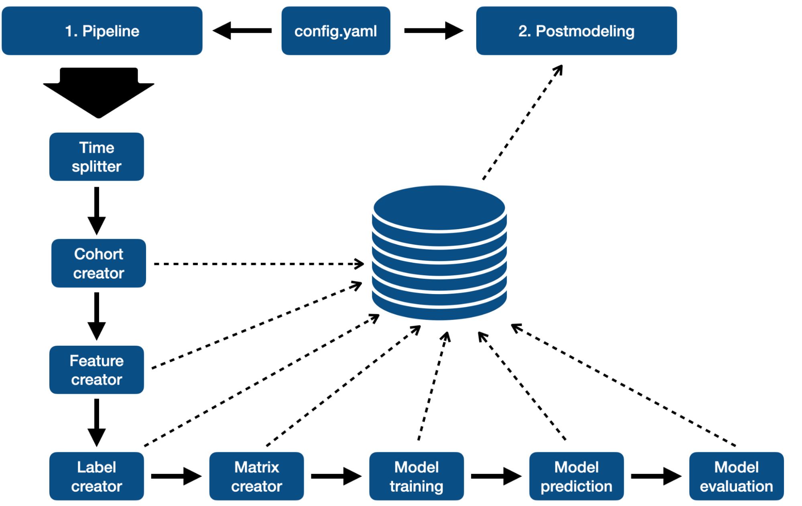

# Minimizing Entry into Homelessness



Repository for DSSG 2022 Project to Reduce Entry Into Homelessness in Allegheny County.

During the Data Science for Social Good Summer Fellowship 2022 at Carnegie Mellon University in Pittsburgh, the following team worked together with the Allegheny County Department of Human Services to reduce the risk of falling into homelessness:

|   |   |
|---|---|
| [Joachim Baumann](https://github.com/joebaumann) | Fellow |
| [Arun Frey](https://github.com/ArunFrey) | Fellow |
| [Abby Smith](https://github.com/abbylsmith) | Fellow |
| [Catalina Vajiac](https://github.com/catvajiac) | Fellow |
| Kit Rodolfa | Data Science Mentor |
| Kasun Amarasinghe | Data Science Mentor |
| Adolfo de Unanue | Data Science Mentor |


## Partner
Allegheny County Department of Human Services (ACDHS)

## Problem

Each year, close to 14,000 individuals face an eviction in Allegheny County. Eviction is a known pathway into homelessness. Here is a map of evictions in Pittsburgh, with blue dots indicating those who fell into homelessness. 




Allegheny County Department of Human Services (ACDHS) seeks to minimize the risk of entering into homelessness as a result of an eviction by providing tenants with rental assistance. Since Allegheny County is only able to provide rental assistance to around 1200 individuals each year, the county hopes to prioritize those individuals who are facing an eviction and are at greatest risk of falling into homelessness in the near future. The current process of allocating rental assistance is reactive, however, requiring individuals who are facing an eviction to reach out to ACDHS in order to be placed on a waitlist, from where funding is distributed on a first-come-first-served basis. This system does not prioritize individuals based on their risk of falling into homelessness, while also missing out on those who need urgenty help but fail to reach out. ACDHS hopes to make this process more proactive and prioritize those who face the greatest need. 


## Data
In this project, we partnered with Allegheny County Department of Human Services to better allocate rental assistance to high risk individuals in order to keep them from falling into homelessness. To do so, we used data from ACDHS’ rich data warehouse, including information on previous evictions, homeless spells, interactions with mental, behavioral, and physical health institutions, address changes, demographic information, as well as enrollment in a variety of other ACDHS and state programs, among others. Using historical data, we trained a series of models that predict an individual’s risk of entering homelessness in the next 12 months among all those with a recent eviction filing. Using these predictions, we can provide Allegheny County with a list of individuals who are currently facing an eviction and are at highest risk of falling into homelessness in the next 12 months. 


# Infrastructure 

A general schematic of our pipeline infrastructure is shown below. 



# Installation and setup

Clone repo:
```
gh repo clone dssg/acdhs_housing
cd acdhs_housing
```


## Virtual environment

Set up virtual environment and install requirements:
```
pip install -r requirements.txt
```

### Virtualenv: team set-up

Need to do only once:

1. To load the project-specific environment variables (such as python path), cd to your directory `/mnt/data/projects/acdhs-housing/[user]` (replace `[user]` with your username) and add the following two lines to your `.envrc` file:

```
source_up
export PYTHONPATH="/mnt/data/projects/acdhs-housing/[user]/acdhs_housing"
```

Without the above, there will be issues finding the correct path.

2. Set `.env` following the example `.env.sample`


## ETL

[ETL instructions](src/etl/README.md)


# Running the Model Pipelines

[Here are the instructions to run the pipeline.](src/pipeline/README.md)

# Postmodeling

[Here are the instructions to do postmodeling.](src/pipeline/postmodeling/README.md)
